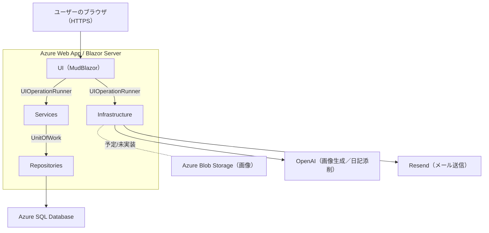

# PhrazorApp
## PhrazorAppの概要
**英作文練習**と**英語日記添削**をメイン機能として、英語表現力の強化を行うアプリケーションです。

## 開発者向けドキュメント

このプロジェクトの実装方針・命名・画面とサービスの役割・バリデーション方針などは  
**[Development Guide](./DEVELOPMENT.md)** にまとめています。

## システム構成図

## ディレクトリ概要

- **Components/** … Razor コンポーネント
  - **Account/** … Identity UI 用のコンポーネント
    - **Pages/** … サインイン/登録/管理などのページ
    - **Shared/** … Identity 専用の共有部品（レイアウト/メニュー等）
  - **Layout/** … MainLayout, NavMenu など
  - **Pages/** … ルーティングされるページ
  - **Shared/** … 再利用コンポーネント
    - **Controls/** … 小UI部品(サービスの処理を含まない)
    - **Containers/** … サービスを利用した処理まで担うUI部品
    - **Dialogs/** … モーダル（*Dialog / *DialogHost）
  - **App.razor / Routes.razor / _Imports.razor** … ルート/ルーティング/共通 using

- **UI/** … UI 制御・UI依存資産
  - **Managers/** … ローディング表示・UI操作のオーケストレーション
  - **Interop/** … JS 連携（IJSRuntime ラッパー等）
  - **State/** … 画面間で保持する状態（Scoped）
  - **Themes/** … アプリ全体の色調などの設定
  - **Rendering/** … RenderModes（Server/Wasm/Auto のプリセット）

- **Services/** … 業務サービス（UI 非依存）

- **Data/** … データアクセス
  - **ApplicationDbContext.cs** … Identity（Code-first）
  - **EngDbContext.cs** … 業務（DB-first, Scaffold 生成物を使用）
  - **Entities/** … Scaffold 生成物
  - **Repositories/** … リポジトリ
  - **Migrations/** … Identity のマイグレーション

- **Infrastructure/** … 外部 I/O（Blob/Email/OpenAI 等）と Options バインド

- **Extensions/** … 拡張メソッド（ダイアログ呼び出しなどの便利メソッド)

- **Common/** … アプリ全体で使用する“定義・設定”
  - **Constants/** … 定数
  - **Csv/** … Csv取込時に利用するスキーマ(列のメタ情報)
  - **Enums/** … 列挙体
  - **Options/** … appsettings.json読込用クラス類
  - **Results/** … 結果型（ServiceResult など）
  - **Validation/** … バリデーションのグローバル設定

- **tools/** … 開発用スクリプト（PowerShell 等）  
  ※ JavaScript は **wwwroot/js/** に配置

- **wwwroot/** … 静的ファイル（js/css/画像 など）

- **GlobalUsings.cs** … グローバル using 定義

