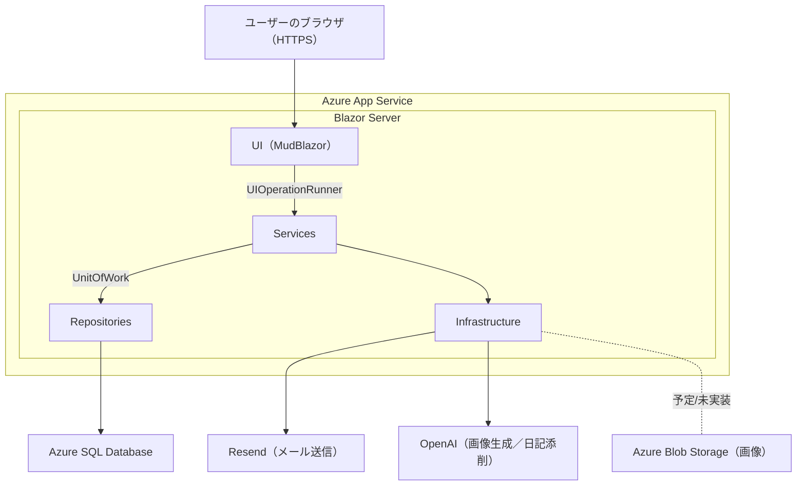

# Phrazor

## 本アプリケーションの概要
本アプリケーションは英作文練習と英語日記添削をメイン機能として、英語表現力の強化を行います。  
  **Webサイト（デモ／運用環境）**：<https://phrazor-b9bdfvccc5avfubc.japanwest-01.azurewebsites.net/>
  > **注意**：本アプリケーションの閲覧・操作には **ログインが必要** です。  

## ご利用上の注意

* 本アプリケーションは **Blazor Server** という C# の Web 技術を使用して作成されていますが、**WebSocket による常時接続が前提**になっているため、WebSocket が頻繁に切断されやすいネットワーク環境では、上手く動作しません。いくつかのネットワーク環境で確認したところ、このパターンが 1 件確認されました。その場合には **スマホからご確認**いただくか、以下リンクから **開発資料（ER 図・操作マニュアル）** だけでもご確認ください。[https://github.com/nsznsnb/PhrazorApp/tree/main/Downloads](https://github.com/nsznsnb/PhrazorApp/tree/main/Downloads)

  ---

## 本アプリケーション使用技術
- **言語 / フレームワーク**：C# / .NET **9.0**（**Blazor Server**）
- **データベース**：**Azure SQL Database**（既定の互換性レベル **170** / SQL Server 2025 相当）
- **UI フレームワーク**：**[MudBlazor](https://mudblazor.com/)**

## 開発者向けドキュメント
このプロジェクトの用語・実装方針は **[開発ガイド](./DEVELOPMENT.md)** にまとめています。

## システム構成図

## ディレクトリ概要

- **Components/** … Razor コンポーネント
  - **Account/** … Identity UI 用のコンポーネント
    - **Pages/** … サインイン/登録/管理などのページ
    - **Shared/** … Identity 専用の共有部品（レイアウト/メニュー等）
  - **Layout/** … MainLayout, NavMenu など
  - **Pages/** … ルーティングされるページ
  - **Shared/** … 再利用コンポーネント
    - **Controls/** … 小UI部品(サービスの処理を含まない)
    - **Containers/** … サービスを利用した処理まで担うUI部品
    - **Dialogs/** … モーダル（*Dialog / *DialogHost）
  - **App.razor / Routes.razor / _Imports.razor** … ルート/ルーティング/共通 using

- **UI/** … UI 制御・UI依存資産
  - **Managers/** … ローディング表示・UI操作のオーケストレーション
  - **Interop/** … JS 連携（IJSRuntime ラッパー等）
  - **State/** … 画面間で保持する状態（Scoped）
  - **Themes/** … アプリ全体の色調などの設定
  - **Rendering/** … RenderModes（Server/Wasm/Auto のプリセット）

- **Services/** … アプリ固有の処理(サービス)

- **Data/** … データベースアクセス
  - **ApplicationDbContext.cs** … ASP.NET Identity (Code-first)
  - **EngDbContext.cs** … EFCore（DB-first）
  - **Entities/** … テーブルを表現するクラス群(エンティティ)
  - **Repositories/** … テーブル操作を担う(レポジトリ)
  - **Migrations/** … Identity のマイグレーション

- **Downloads/** … 外部配信するファイル群

- **Endpoints/** … Minimal API 群（認可付きファイル配信用API 等)

- **Infrastructure/** … 外部 I/O（Blob/Email/OpenAI 等）

- **Extensions/** … 拡張メソッド（ダイアログ呼び出しなどの便利メソッド)

- **Common/** … アプリ全体で使用する“定義・設定”
  - **Constants/** … 定数
  - **Csv/** … Csv取込時に利用するスキーマ(列のメタ情報)
  - **Enums/** … 列挙体
  - **Options/** … appsettings.json読込用クラス類
  - **Results/** … 結果型（ServiceResult など）
  - **Validation/** … バリデーションのグローバル設定

- **tools/** … 開発用スクリプト（PowerShell 等）  
  ※ JavaScript は **wwwroot/js/** に配置

- **wwwroot/** … 静的ファイル（js/css/画像 など）

- **GlobalUsings.cs** … グローバル using 定義

